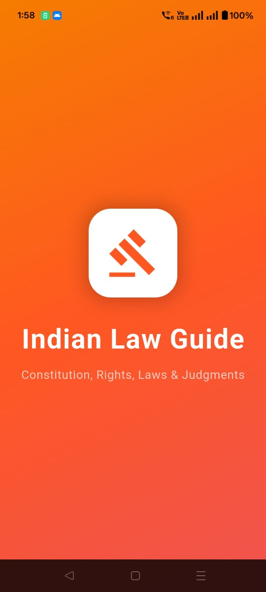
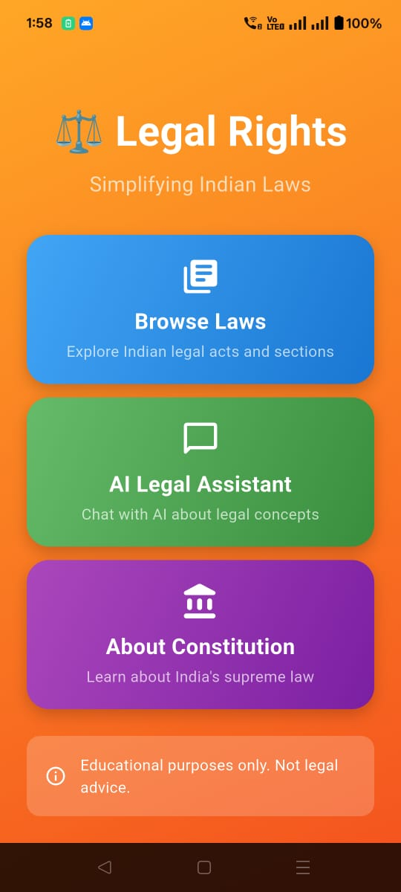
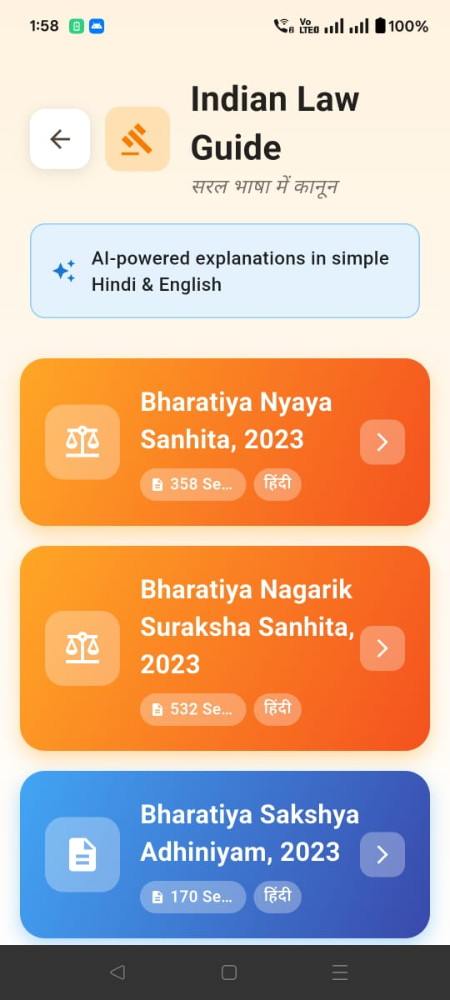
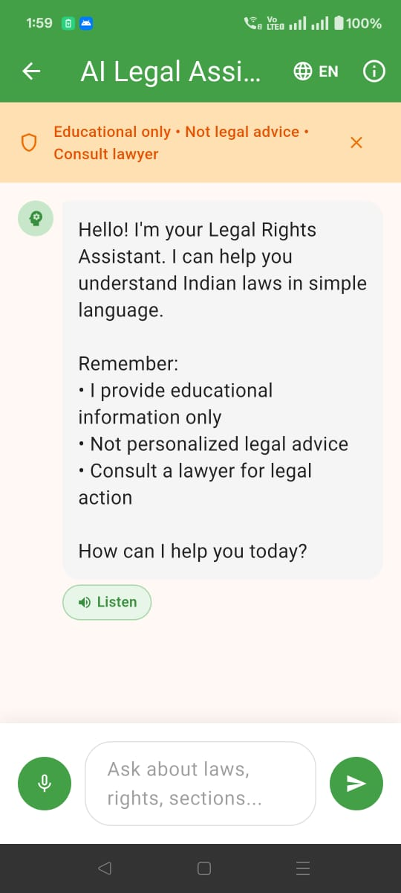
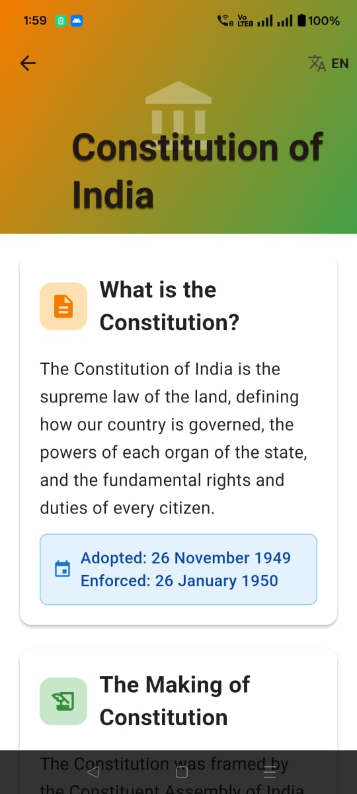

# 🏛️ Indian Constitution Vault

**Making Indian Law Accessible to Every Citizen**

A beautiful, bilingual (English & Hindi) mobile application powered by AI that simplifies Indian laws for common people. Built with Flutter and FastAPI, featuring voice interaction, ethical AI chatbot, and comprehensive legal database.

[](https://flutter.dev/)
[](https://fastapi.tiangolo.com/)
[](LICENSE)

## 📱 Screenshots

<div align="center">

| Indian Law Guide | Main Navigation | Section Details |
|:---:|:---:|:---:|
|  |  |  | 

| AI Chat Assistant | About Constitution |
|:---:|:---:|
|  |  |

</div>

## 🌟 Key Features

### 🎯 Core Capabilities
- **📚 Comprehensive Legal Database** - 5 major Indian legal acts with 2000+ sections
- **🤖 AI-Powered Explanations** - Complex legal text simplified using Google Gemini AI
- **💬 Ethical Chatbot** - Smart legal assistant with built-in safety guardrails
- **🎤 Voice Interaction** - Speech-to-text input and text-to-speech output in English & Hindi
- **🌐 Bilingual Support** - Complete interface and content in English and Hindi
- **🎨 Beautiful UI** - Material Design 3 with gradient cards and smooth animations

### 📖 Legal Acts Covered
| Act | Year | Sections | Languages |
|-----|------|----------|-----------|
| Bharatiya Nyaya Sanhita (BNS) | 2023 | 358 | EN + हिंदी |
| Bharatiya Nagarik Suraksha Sanhita (BNSS) | 2023 | 532 | EN + हिंदी |
| Bharatiya Sakshya Adhiniyam (BSA) | 2023 | 170 | EN + हिंदी |
| Code of Criminal Procedure (CRPC) | 1973 | 533 | EN |
| Indian Penal Code (IPC) | 1860 | 515 | EN |

### 🛡️ Ethical AI Design
- ✅ Educational information only, not personalized legal advice
- ✅ Automatic filtering of prohibited questions
- ✅ Clear disclaimers on every interaction
- ✅ Politically neutral and unbiased
- ✅ Encourages professional legal consultation
- ✅ No storage of personal information

## 🛠️ Tech Stack

**Frontend:**
- Flutter 3.32.5 - Cross-platform framework
- Riverpod - State management
- GoRouter - Navigation
- flutter_tts - Text-to-speech
- speech_to_text - Voice input

**Backend:**
- FastAPI - Modern Python web framework
- Google Gemini AI - AI explanations
- Uvicorn - ASGI server

## 🚀 Quick Start

### Platforms
- **📱 Mobile**: Android & iOS
- **🌐 Web**: Deploy to Netlify, Vercel, Firebase Hosting, etc.

### Prerequisites
- Flutter SDK 3.32.5+
- Python 3.10+
- Google Gemini API Key ([Get here](https://aistudio.google.com/app/apikey))

### Setup

**1. Backend:**
```bash
cd backend
pip install -r requirements.txt

# Copy .env.example to .env and add your keys
cp .env.example .env
# Edit .env and add:
# GEMINI_API_KEY=your_gemini_key
# APP_API_KEY=generate_secure_key (see SECURITY.md)

python -m uvicorn app.main:app --reload
```

**2. Mobile:**
```bash
cd mobile
flutter pub get

# Update lib/config/app_config.dart with your backend URL and API key
dart run build_runner build --delete-conflicting-outputs
flutter run
```

**3. Web Deployment:**
```bash
cd mobile
flutter pub get
flutter build web --release

# Deploy to Netlify (see QUICK_START_NETLIFY.md for detailed guide)
```

📖 **Web Deployment Guides:**
- [🚀 Quick Start Guide](QUICK_START_NETLIFY.md) - Deploy in 2 minutes
- [📘 Detailed Deployment](NETLIFY_DEPLOYMENT.md) - Complete instructions
- [✅ Deployment Checklist](DEPLOYMENT_CHECKLIST.md) - Step-by-step checklist
- [📊 Conversion Summary](CONVERSION_SUMMARY.md) - What was converted

**⚠️ Important:** See [SECURITY.md](SECURITY.md) for API authentication setup before deploying to production.

## 📐 Architecture

```
Constitution_app/
├── backend/
│   ├── app/
│   │   ├── main.py         # API routes
│   │   ├── ai_service.py   # Gemini integration
│   │   └── models.py       # Data models
│   └── data/structured/    # Legal JSON data
└── mobile/
    └── lib/
        ├── screens/        # UI screens
        ├── providers/      # State management
        ├── models/         # Data models
        └── services/       # API services
```

## 🌍 Roadmap

- [x] AI-powered explanations with Google Gemini
- [x] Ethical chatbot with safety constraints
- [x] Bilingual support (English & Hindi)
- [x] Material Design 3 UI
- [x] Voice-to-voice interaction (TTS + STT)
- [x] 2000+ legal sections database

## 🤝 Contributing

Contributions are welcome! Please:
1. Fork the repository
2. Create a feature branch (`git checkout -b feature/AmazingFeature`)
3. Commit changes (`git commit -m 'Add AmazingFeature'`)
4. Push to branch (`git push origin feature/AmazingFeature`)
5. Open a Pull Request

## 📄 License

This project is licensed under the MIT License - see [LICENSE](LICENSE) for details.

## 🙏 Acknowledgments

- Legal data from official government sources
- AI powered by Google Gemini 2.5 Flash
- Icons from Material Design
- Flutter & FastAPI communities

---

<div align="center">

**Made with ❤️ for the people of India**

*Making law accessible, one section at a time.*

[⭐ Star this repo](https://github.com/unnatii14/Indian-Constitution-Vault) if you find it helpful!

</div>
