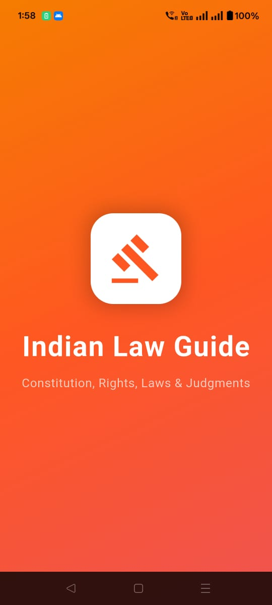
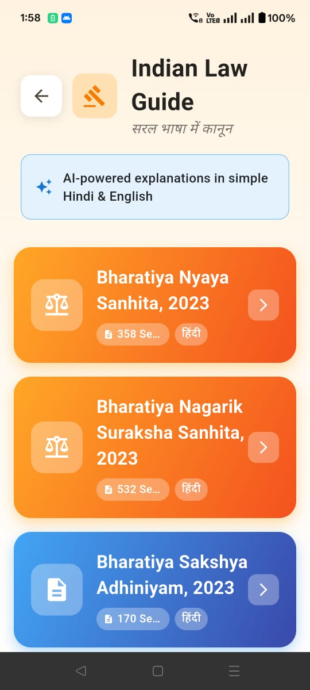
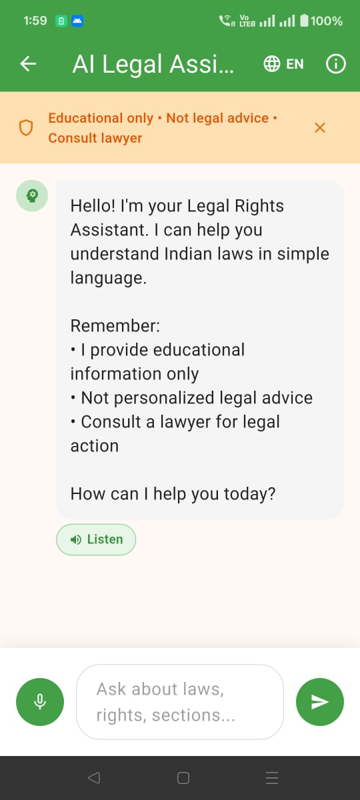
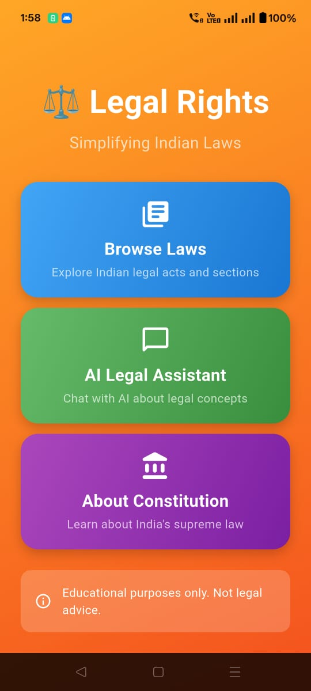
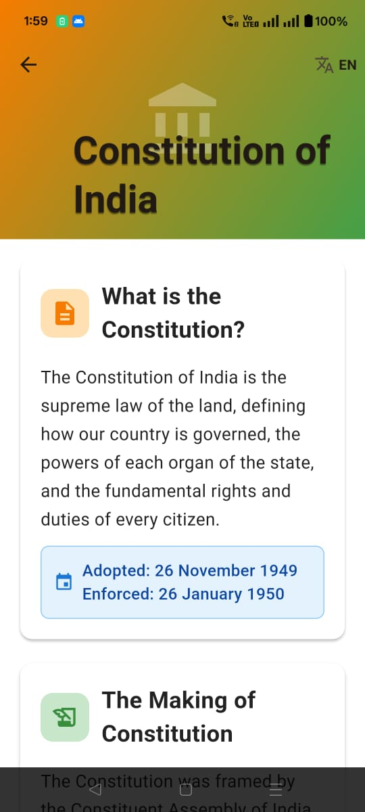

# 🏛️ Indian Constitution Vault

**Making Indian Law Accessible to Every Citizen - Now 100% Offline!**

A beautiful, bilingual (English & Hindi) mobile and web application that helps you explore Indian laws easily. The mobile app is **fully offline** - all data is bundled locally for instant access without internet. Built with Flutter and FastAPI, featuring categorized law finder, comprehensive legal database, and intuitive navigation.

[](https://flutter.dev/)
[](https://fastapi.tiangolo.com/)
[](LICENSE)
[](OFFLINE_IMPLEMENTATION.md)
[](https://enchanting-queijadas-bcd393.netlify.app/)

## 🚀 New: Fully Offline Mobile App!

The mobile app now works **completely offline** with no internet required:
- ⚡ **50x faster** - Instant data access (<100ms vs 2-5s)
- 💰 **$0 cost** - No server hosting needed
- 🌐 **Works anywhere** - No internet needed
- 🔒 **Complete privacy** - All data stays on your device
- 📦 **Small size** - Only ~40MB with all data included

📖 **[Read the offline implementation guide →](OFFLINE_IMPLEMENTATION.md)**

## 🌐 Live Demo

**Try it now:** [https://indian-constitution-vault.netlify.app/](https://indian-constitution-vault.netlify.app/)

Available on:
- 📱 **Android**: Fully offline app - Download from releases
- 🌐 **Web**: Access instantly in your browser (online)
- 🍎 **iOS**: Coming soon

## 📱 Screenshots

<div align="center">

| Main Navigation | Law Finder | Browse Acts |
|:---:|:---:|:---:|
|  |  |  |

| About Constitution | Section Details |
|:---:|:---:|
|  |  |

</div>

## 🌟 Key Features

### 🎯 Core Capabilities
- **📚 Comprehensive Legal Database** - 5 major Indian legal acts with 2000+ sections
- **🔍 Law Finder** - Browse laws by categories (Criminal Law, Property Rights, Women's Rights, Cyber Crime, Consumer Rights, etc.)
- **📖 Browse Acts** - Explore all acts and their sections systematically
- **🌐 Bilingual Support** - Complete interface and content in English and Hindi
- **🎨 Beautiful UI** - Material Design 3 with gradient cards and smooth animations
- **🌐 Web & Mobile** - Access on any device - desktop, tablet, or mobile

### 📖 Legal Acts Covered
| Act | Year | Sections | Languages |
|-----|------|----------|-----------|
| Bharatiya Nyaya Sanhita (BNS) | 2023 | 358 | EN + हिंदी |
| Bharatiya Nagarik Suraksha Sanhita (BNSS) | 2023 | 532 | EN + हिंदी |
| Bharatiya Sakshya Adhiniyam (BSA) | 2023 | 170 | EN + हिंदी |
| Code of Criminal Procedure (CRPC) | 1973 | 533 | EN |
| Indian Penal Code (IPC) | 1860 | 515 | EN |

### 🎯 Law Categories
- **⚖️ Criminal Law** - Offences, punishments & criminal procedures
- **🏠 Property Rights** - Land, property and ownership laws
- **♀️ Women's Rights** - Laws protecting women
- **💻 Cyber Crime** - Online and digital offences
- **🛒 Consumer Rights** - Shopping and consumer protection
- **📄 Documentation** - Legal documents and procedures
- **👨‍👩‍👧 Family Law** - Marriage, divorce and family matters
- **💼 Employment** - Labor laws and workplace rights

## 🛠️ Tech Stack

**Frontend:**
- Flutter 3.32.5 - Cross-platform framework (Web, Android, iOS)
- Riverpod - State management
- GoRouter - Navigation and routing
- Material Design 3 - Modern UI components

**Backend:**
- FastAPI - Modern Python web framework
- JSON Database - Structured legal data
- Uvicorn - ASGI server

**Deployment:**
- Netlify - Web hosting with CDN
- Render - Backend API hosting

## 🚀 Quick Start

### Platforms
- **📱 Mobile**: Android & iOS
- **🌐 Web**: Deploy to Netlify, Vercel, Firebase Hosting, etc.

### Prerequisites
- Flutter SDK 3.32.5+
- Python 3.10+ (for backend)
- Git

### Setup

**1. Backend:**
```bash
cd backend
pip install -r requirements.txt
python -m uvicorn app.main:app --reload
```

**2. Mobile:**
```bash
cd mobile
flutter pub get

# Update lib/config/app_config.dart with your backend URL and API key
dart run build_runner build --delete-conflicting-outputs
flutter run
```

**3. Web Deployment:**
```bash
cd mobile
flutter pub get
flutter build web --release

# Deploy to Netlify (see QUICK_START_NETLIFY.md for detailed guide)
```

📖 **Web Deployment Guides:**
- [🚀 Quick Start Guide](QUICK_START_NETLIFY.md) - Deploy in 2 minutes
- [📘 Detailed Deployment](NETLIFY_DEPLOYMENT.md) - Complete instructions
- [✅ Deployment Checklist](DEPLOYMENT_CHECKLIST.md) - Step-by-step checklist
- [📊 Conversion Summary](CONVERSION_SUMMARY.md) - What was converted

**⚠️ Important:** See [SECURITY.md](SECURITY.md) for API authentication setup before deploying to production.

## 📐 Architecture

```
Constitution_Website/
├── backend/
│   ├── app/
│   │   ├── main.py         # FastAPI routes
│   │   ├── data_loader.py  # Load legal data
│   │   └── models.py       # Data models
│   └── data/structured/    # Legal JSON database
├── mobile/
│   ├── lib/
│   │   ├── screens/        # UI screens (Law Finder, Acts, Sections)
│   │   ├── providers/      # State management
│   │   ├── models/         # Data models
│   │   └── services/       # API services
│   └── web/                # Web-specific files
└── .github/workflows/      # CI/CD for Netlify
```

## 🌍 Roadmap

- [x] Comprehensive legal database with 2000+ sections
- [x] Law Finder with categorized search
- [x] Bilingual support (English & Hindi)
- [x] Material Design 3 UI
- [x] Web application deployed on Netlify
- [ ] Search functionality across all acts
- [ ] Bookmarks and favorites
- [ ] Dark mode
- [ ] Download sections as PDF
- [ ] Share sections via social media

## 🤝 Contributing

Contributions are welcome! Please:
1. Fork the repository
2. Create a feature branch (`git checkout -b feature/AmazingFeature`)
3. Commit changes (`git commit -m 'Add AmazingFeature'`)
4. Push to branch (`git push origin feature/AmazingFeature`)
5. Open a Pull Request

## 📄 License

This project is licensed under the MIT License - see [LICENSE](LICENSE) for details.

## 🙏 Acknowledgments

- Legal data from official Indian government sources
- Built with Flutter & FastAPI
- Icons from Material Design
- Hosted on Netlify & Render
- Open source contribution from the community

---

<div align="center">

**Made with ❤️ for the people of India**

*Making law accessible, one section at a time.*

[⭐ Star this repo](https://github.com/unnatii14/Indian-Constitution-Vault) if you find it helpful!

</div>
